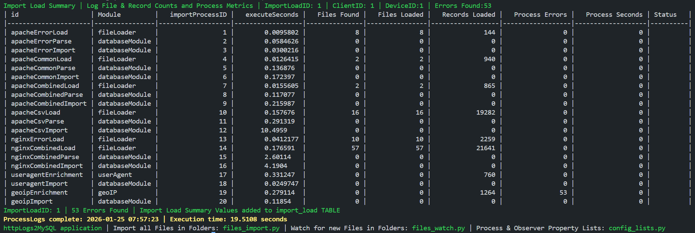
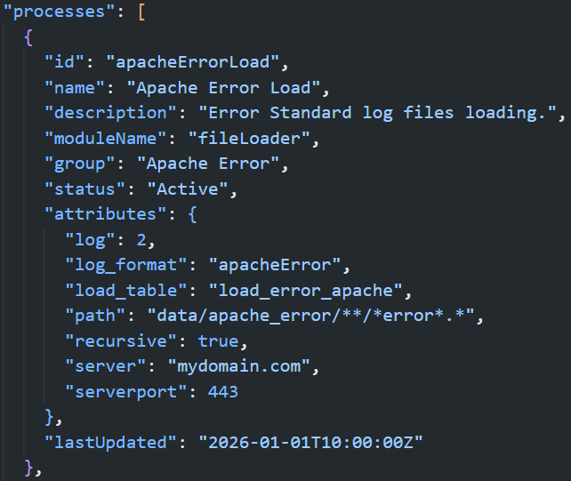
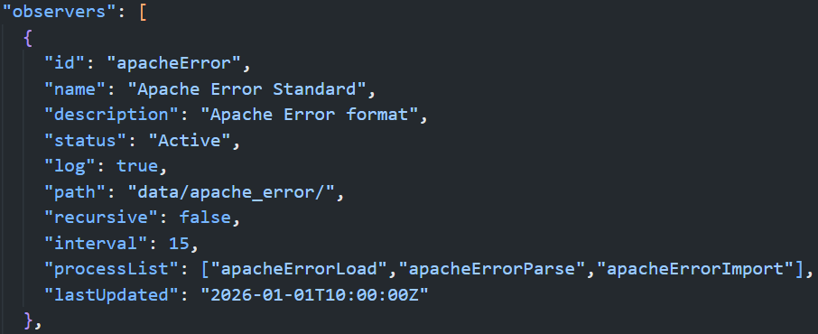
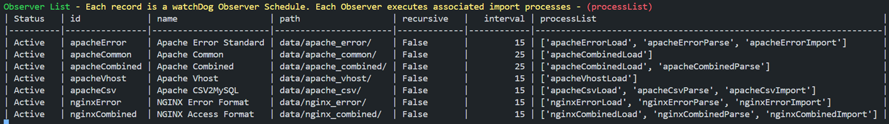

## Python handles File Processing & Database handles Data Processing

`main:process_files` "process summary" screenshot from ingesting log files included in repository.

httpLogs2MySQL is a Python ***JSON data-driven*** App & MySQL schema to automate importing access & error files, normalizing log data into database and generating a well-documented data lineage audit trail 24/7.

Process properties - collection of Processes executed filtered or individually in `main:process_files`



watchdog Observer properties - collection of Observers that execute `main:process_files` with file(s) parameter



All processing stages (child processes) are encapsulated within one `main:process_files` (parent process) that captures process metrics, notifications and errors into database import tables.

Every log data record is traceable back to the computer, path, file, load process, parse process and import process the data originates from.

Python handles polling of log file folders and executing database LOAD DATA, Procedures, Functions and SQL Statements. List of Observers Watching:



Python drives the application but MySQL or MariaDB does all Data Manipulation & Processing. 

Multiple access and error logs and formats can be loaded, parsed and imported along with User Agent parsing and IP Address Geolocation retrieval processes within a single `main:process_files` execution. 

`main:process_files` execution can be configured to only load logs to Server (single child process) leaving other processes to be executed within another `main:process_files` on a centralized computer.
### Application runs on Windows, Linux & MacOS - Database runs on MySQL & MariaDB

## Database designed for HTTP log data analysis
Application determines what files have been processed using `import_file` TABLE. 
Each imported file has record with name, path, size, created, modified attributes inserted during `main:process_files`.

Application runs with no need for user interaction. File deletion is not required by application if files desired for later reference.
## Data Enrichments
### IP Geolocation data integration
using [MaxMind GeoIP2](https://pypi.org/project/geoip2/) Python API provides IP country, subdivision, city, system organization, 
network and coordinates information stored and normalized into 6 database schema tables.

Application requires two GeoLite databases - ***City*** & ***ASN***. GeoLite databases are subsets of the commercial databases with reduced coverage and accuracy. Application tested with these databases: 
1) GeoLite2 databases at [MaxMind](https://www.maxmind.com/en/geolite-free-ip-geolocation-data) available under MaxMind continues to incorporate Creative Commons into our GeoLite End User Agreement (EULA).

2) DB-IP Lite databases at [DB-IP](https://db-ip.com/db/lite.php) available under Creative Commons Attribution 4.0 International License.
### User-Agent data integration
using [user-agents](https://pypi.org/project/user-agents/) provides browser, device and operating system information stored and normalized into 11 database schema tables.
## Visual Interface App
in my development queue [MySQL2ApacheECharts](https://github.com/willthefarmer/mysql-to-apache-echarts) is a ***visualization tool*** for the database schema. The Web interface consists of [Express](https://github.com/expressjs/express) web application frameworks with [W2UI](https://github.com/vitmalina/w2ui) drill-down data grids for Data Point Details 
& [Apache ECharts](https://github.com/apache/echarts) frameworks for Data Visualization.
## MySQL database schema DDL and build scripts
[mysql-schema-http-logs](https://github.com/willthefarmer/mysql-schema-http-logs) includes all ***database DDL and build scripts*** for the database schema used in this repository.
## Required Python Packages
Single quotes around 'PyMySQL[rsa]' package required on macOS.
|Python Package|Installation Command|GitHub Repository|
|--------------|---------------|------------|
|[PyMySQL](https://pypi.org/project/PyMySQL/)|python -m pip install PyMySQL|[PyMySQL/PyMySQL](https://github.com/PyMySQL/PyMySQL)|
|[user-agents](https://pypi.org/project/user-agents/)|python -m pip install pyyaml ua-parser user-agents|[selwin/python-user-agents](https://github.com/selwin/python-user-agents)|
|[watchdog](https://pypi.org/project/watchdog/)|python -m pip install watchdog|[gorakhargosh/watchdog](https://github.com/gorakhargosh/watchdog/tree/master)|
|[python-dotenv](https://pypi.org/project/python-dotenv/)|python -m pip install python-dotenv|[theskumar/python-dotenv](https://github.com/theskumar/python-dotenv)|
|[geoip2](https://pypi.org/project/geoip2/)|python -m pip install geoip2|[maxmind/GeoIP2-python](https://github.com/maxmind/GeoIP2-python)|
|[tabulate](https://pypi.org/project/tabulate/)|python -m pip install tabulate|[astanin/python-tabulate](https://github.com/astanin/python-tabulate)|

## Installation Instructions
Steps make installation quick and straightforward. Application will be ready to import HTTP logs on completion.

### 1. Python
Install all required packages (`requirements.txt` in repository):
```
pip install -r requirements.txt
```
### 2. Database
Before running `create_http_logs.sql` if User Account `root`@`localhost` does not exist on installation server open 
file and perform a ***Find and Replace*** using a User Account with DBA Role on installation server. Copy below:
```
root`@`localhost`
```
Rename above <sup>user</sup> to a <sup>user</sup> on your server. For example - `root`@`localhost` to `dbadmin`@`localhost`

The easiest way to install is use database Command Line Client. Login as User with DBA Role and execute the following:
```
source path/create_http_logs.sql
```
Only MySQL server must be configured in `my.ini`, `mysqld.cnf` or `my.cnf` depending on platform with following: 
```
[mysqld]
local-infile=1
```
### 3. Create database USER & GRANTS
To minimize data exposure and breach risks create a database USER for Python module with GRANTS to only schema objects and privileges required to execute import processes. Replace hostname from `localhost` to hostname of installed database if different. (`mysql_user_and_grants.sql` in repository)
### 4. Run Application

Run `files_import.py` to ingest all files in configured folders. Next time `files_import.py` is run only new files since last run will be processed. It knows what files have been imported.

Run `files_watch.py` and add file or files to a configured folder. Application `main:process_files` will process ONLY the added files. Multiple folders and formats can be processed in one run.

To process all files in the shared configured folder run `files_import.py`. All unprocessed files in folders will be ingested.

The included `config.json` has Processes and Observers configured to share folders. Any number of Processes and Objects can run in a single `main:process_files` execution.  

Run import process directly:
```
python3 files_import.py
```
Run polling module:
```
python3 files_watch.py
```
