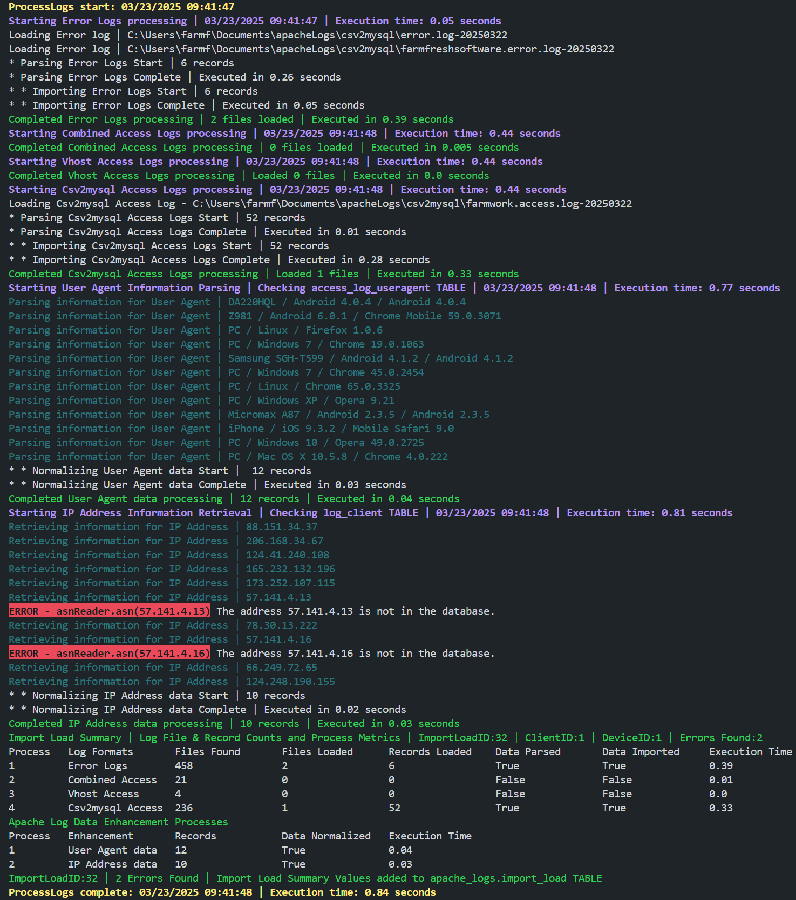
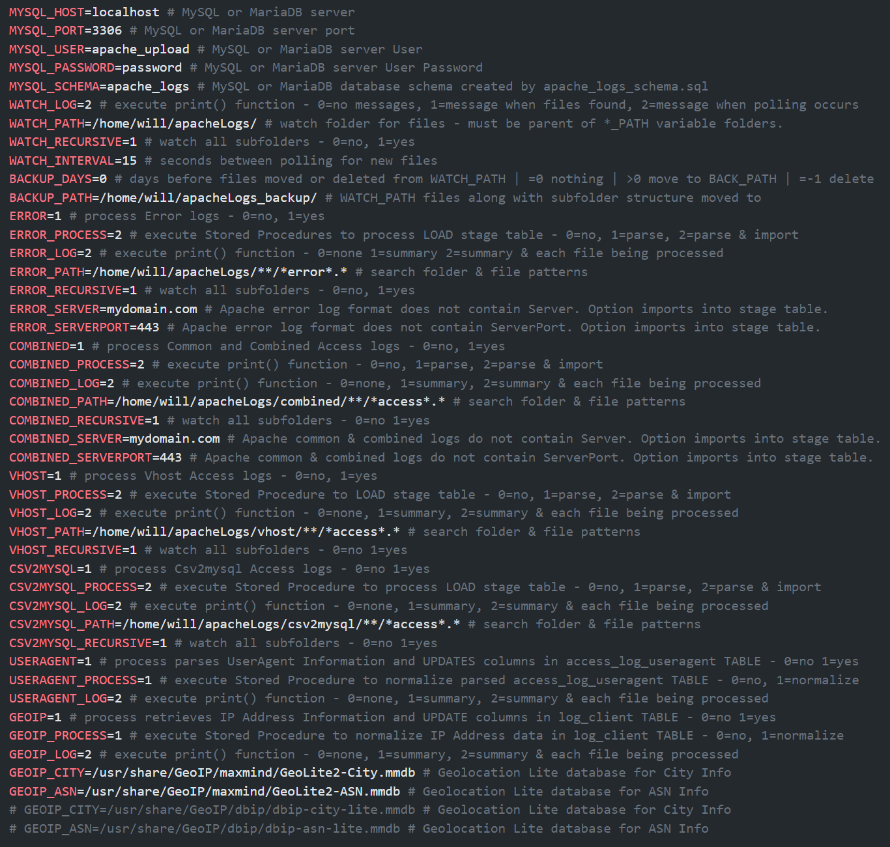

# Database designed for Apache log data analysis 

## Python handles File Processing & Database handles Data Processing
ApacheLogs2MySQL consists of two Python Modules & one Database Schema ***apache_logs*** to automate importing Access & Error files, normalizing log data into database and generating a well-documented data lineage audit trail.

Imports Access Logs in LogFormats - ***common***, ***combined*** and ***vhost_combined*** & additional ***csv2mysql*** 
LogFormat defined below.

Imports Error Logs in ***default*** ErrorLogFormat & ***additional*** ErrorLogFormat defined below performing data harmonization 
on Apache Codes & Messages, System Codes & Messages, and Log Messages to create a unified, standardized dataset.

All processing stages (child processes) are encapsulated within one "Import Load" (parent process) that captures process metrics, notifications and errors into Database import tables. 
Every log data record is traceable back to the computer, path, file, load process, parse process and import process the data originates from.

Multiple Access and Error logs and formats can be loaded, parsed and imported along with User Agent parsing and IP Address Geolocation retrieval processes within a single "Import Load" execution. 

A single "Import Load" execution can also be configured to only load logs to Server (single child process) leaving other processes to be executed within another "Import Load" on a centralized computer.
### Process Messages in Console - 4 LogFormats, 2 ErrorLogFormats & 6 Stored Procedures can be processed in a single Import Load execution

### Application runs on Windows, Linux & MacOS - Database runs on MySQL & MariaDB
This is a fast, reliable processing application with detailed logging and two stages of data parsing. 
First stage is performed in `LOAD DATA LOCAL INFILE` statements. 
Second stage is performed in `process_access_parse` and `process_error_parse` Stored Procedures.

Python handles polling of log file folders and executing Database LOAD DATA, Stored Procedures, Stored Functions and SQL Statements. Python drives the application but MySQL or MariaDB does all Data Manipulation & Processing.

Application determines what files have been processed using `apache_logs.import_file` TABLE. 
Each imported file has record with name, path, size, created, modified attributes inserted during `processLogs`.

Application runs with no need for user interaction. File deletion is not required by application if files desired for later reference.

On servers, run application in conjunction with [logrotate](https://github.com/logrotate/logrotate) using [configuration file directives](https://man7.org/linux/man-pages/man8/logrotate.8.html) - `dateext`, `rotate`, `olddir`, `nocompress`, `notifempty`, `maxage`.
Set `WATCH_PATH` to same folder as `olddir` and configure logrotate to delete files.

On centralized computers, environment variables - `BACKUP_DAYS` and `BACKUP_PATH` can be configured to remove files from `WATCH_PATH` to reduce `apache_logs.importFileExists` execution in `processLogs` when tens of thousands of files exist in `WATCH_PATH` subfolder structure. If `BACKUP_DAYS` is set to 0 files are never moved or deleted from `WATCH_PATH` subfolder structure. Setting `BACKUP_DAYS` to a positive number will copy files to `BACKUP_PATH` creating an identical subfolder structure as `WATCH_PATH` as files are copied. `BACKUP_DAYS` is number of days since file was initially added to `apache_logs.import_file` TABLE before file is moved to `BACKUP_PATH`. Once file is copied the file will be deleted from `WATCH_PATH`. Setting `BACKUP_DAYS` = -1 files are not copied to `BACKUP_PATH` before deleting files from `WATCH_PATH`. When `BACKUP_DAYS` is set to -1 files are deleted from `WATCH_PATH` next time `processLogs` is executed.

Log-level variables can be set to display Process Messages in console or inserted into [PM2](https://github.com/Unitech/pm2) logs for every process step. 
All import errors in Python `processLogs` (client) and Stored Procedures (server) are inserted into `apache_logs.import_error` TABLE.
This is the only schema table that uses ENGINE=MYISAM to avoid TRANSACTION ROLLBACKS.

Logging functionality, database design and table relationship constraints produce both physical and logical integrity. 
This enables a complete audit trail providing ability to determine who, what, when and where each log record originated from.

All folder paths, filename patterns, logging, processing, Database connection setting variables are in .env file for easy installation and maintenance.

Client `watch4logs` module can run in [PM2](https://github.com/Unitech/pm2) daemon process manager or `logs2mysql` module run in [logrotate's](https://github.com/logrotate/logrotate) apache `postrotate` configuration for 24/7 online processing on multiple web servers feeding a single Server module simultaneous.
### Valuable Data Enrichment & Visual Enhancements
***IP Geolocation data*** integration using [MaxMind GeoIP2](https://pypi.org/project/geoip2/) Python API provides IP country, subdivision, city, system organization, 
network and coordinates information stored and normalized into 6 Database Schema tables.

Application requires two GeoLite Databases - ***City*** & ***ASN***. GeoLite databases are subsets of the commercial databases with reduced coverage and accuracy. Application tested with these databases: 
1) GeoLite2 databases at [MaxMind](https://www.maxmind.com/en/geolite-free-ip-geolocation-data) available under MaxMind continues to incorporate Creative Commons into our GeoLite End User Agreement (EULA).

2) DB-IP Lite databases at [DB-IP](https://db-ip.com/db/lite.php) available under Creative Commons Attribution 4.0 International License.

***User-Agent data*** integration using [user-agents](https://pypi.org/project/user-agents/) provides browser, device and operating system information stored and normalized into 11 Database Schema tables.

[MySQL2ApacheECharts](https://github.com/willthefarmer/mysql-to-apache-echarts) is a ***visualization tool*** for the Database Schema ***apache_logs*** currently under development. The Web interface consists of [Express](https://github.com/expressjs/express) web application frameworks with Drill Down Capability 
& [Apache ECharts](https://github.com/apache/echarts) frameworks for Data Visualization.
## Four Supported Access Log Formats
Apache uses same Standard Access LogFormats (***common***, ***combined***, ***vhost_combined***) on all 3 platforms. Each LogFormat adds 2 Format Strings to the prior. 
Format String descriptions are listed below each LogFormat. Information from: https://httpd.apache.org/docs/2.4/mod/mod_log_config.html#logformat 
```
LogFormat "%h %l %u %t \"%r\" %>s %O" common
```
|Format String|Description|
|-------------|-----------|
|%h|Remote hostname. Will log IP address if HostnameLookups is set to Off, which is default. If it logs hostname for only a few hosts, you probably have access control directives mentioning them by name.|
|%l|Remote logname. Returns dash unless "mod_ident" is present and IdentityCheck is set On. This can cause serious latency problems accessing server since every request requires a lookup be performed.| 
|%u|Remote user if the request was authenticated. May be bogus if return status (%s) is 401 (unauthorized).|
|%t|Time the request was received, in the format [18/Sep/2011:19:18:28 -0400]. The last number indicates the timezone offset from GMT|
|%r|First line of request. Contains 4 format strings (%m - The request method, %U - The URL path requested not including any query string, %q - The query string, %H - The request protocol)|
|%s|Status. For requests that have been internally redirected, this is the status of the original request. Use %>s for the final status.|
|%O|Bytes sent, including headers. May be zero in rare cases such as when a request is aborted before a response is sent. You need to enable mod_logio to use this.|
```
LogFormat "%h %l %u %t \"%r\" %>s %O \"%{Referer}i\" \"%{User-Agent}i\"" combined
```
|Format String|Description - additional format strings|
|-------------|-----------|
|"%{Referer}i|The "Referer" (sic) HTTP request header. This gives the site that the client reports having been referred from.|
|%{User-Agent}i|The User-Agent HTTP request header. This is the identifying information that the client browser reports about itself.|
```
LogFormat "%v:%p %h %l %u %t \"%r\" %>s %O \"%{Referer}i\" \"%{User-Agent}i\"" vhost_combined
```
|Format String|Description - additional format strings|
|-------------|-----------|
|%v|The canonical ServerName of the server serving the request.|
|%p|The canonical port of the server serving the request.|

Application is designed to use the ***csv2mysql*** LogFormat. LogFormat has comma-separated values and adds 8 Format Strings. A complete list of Format Strings
with descriptions indicating added Format Strings below.
```
LogFormat "%v,%p,%h,%l,%u,%t,%I,%O,%S,%B,%{ms}T,%D,%^FB,%>s,\"%H\",\"%m\",\"%U\",\"%q\",\"%{Referer}i\",\"%{User-Agent}i\",\"%{VARNAME}C\",%L" csv2mysql
```
|Format String|Description|
|-------------|-----------|
|%v|The canonical ServerName of the server serving the request.|
|%p|The canonical port of the server serving the request.|
|%h|Remote hostname. Will log the IP address if HostnameLookups is set to Off, which is the default.|
|%l|Remote logname. Returns dash unless "mod_ident" is present and IdentityCheck is set On. This can cause serious latency problems accessing server since every request requires a lookup be performed.| 
|%u|Remote user if the request was authenticated. May be bogus if return status (%s) is 401 (unauthorized).|
|%t|Time the request was received, in the format [18/Sep/2011:19:18:28 -0400]. The last number indicates the timezone offset from GMT|
|%I|ADDED - Bytes received, including request and headers. Enable "mod_logio" to use this.|
|%O|Bytes sent, including headers. The %O format provided by mod_logio will log the actual number of bytes sent over the network. Enable "mod_logio" to use this.|
|%S|ADDED - Bytes transferred (received and sent), including request and headers, cannot be zero. This is the combination of %I and %O. Enable "mod_logio" to use this.|
|%B|ADDED - Size of response in bytes, excluding HTTP headers. Does not represent number of bytes sent to client, but size in bytes of HTTP response (will differ, if connection is aborted, or if SSL is used).|
|%{ms}T|ADDED - The time taken to serve the request, in milliseconds. Combining %T with a unit is available in 2.4.13 and later.|
|%D|ADDED - The time taken to serve the request, in microseconds.|
|%^FB|ADDED - Delay in microseconds between when the request arrived and the first byte of the response headers are written. Only available if LogIOTrackTTFB is set to ON. Available in Apache 2.4.13 and later.|
|%s|Status. For requests that have been internally redirected, this is the status of the original request.|
|%H|The request protocol. Included in %r - First line of request.|
|%m|The request method. Included in %r - First line of request.|
|%U|The URL path requested, not including any query string. Included in %r - First line of request.|
|%q|The query string (prepended with a ? if a query string exists, otherwise an empty string). Included in %r - First line of request.|
|%{Referer}i|The "Referer" (sic) HTTP request header. This gives the site that the client reports having been referred from.|
|%{User-Agent}i|The User-Agent HTTP request header. This is the identifying information that the client browser reports about itself.|
|%{VARNAME}C|ADDED - The contents of cookie VARNAME in request sent to server. Only version 0 cookies are fully supported. Format String is optional.|
|%L|ADDED - The request log ID from the error log (or '-' if nothing has been logged to the error log for this request). Look for the matching error log line to see what request| caused what error.
## Two supported Error Log Formats
Application processes Error Logs with ***default format*** for threaded MPMs (Multi-Processing Modules). If running Apache 2.4 on any platform 
and ErrorLogFormat is not defined in config files this is the Error Log format.
Information from: https://httpd.apache.org/docs/2.4/mod/core.html#errorlogformat
```
ErrorLogFormat "[%{u}t] [%-m:%l] [pid %P:tid %T] %7F: %E: [client\ %a] %M% ,\ referer\ %{Referer}i"
```
|Format String|Description|
|-------------|-----------|
|%{u}t|The current time including micro-seconds|
|%m|Name of the module logging the message|
|%l|Loglevel of the message|
|%P|Process ID of current process|
|%T|Thread ID of current thread|
|%F|Source file name and line number of the log call. %7F - the 7 means only display when LogLevel=debug|
|%E|APR/OS error status code and string|
|%a|Client IP address and port of the request|
|%M|The actual log message|
|%{Referer}i|The "Referer" (sic) HTTP request header. This gives the site that the client reports having been referred from.| 

Application also processes Error Logs with ***additional format*** which adds:
 1) `%v - The canonical ServerName` - This is easiest way to identify error logs for each domain is add `%v` to ErrorLogFormat. 
 2) `%L - Log ID of the request` - This is easiest way to associate Access record that created an Error record. 
 Apache mod_unique_id.generate_log_id() only called when error occurs and will not cause performance degradation under error-free operations. 

***Important:*** `Space` required on left-side of `Commas` as defined below:
```
ErrorLogFormat "[%{u}t] [%-m:%l] [pid %P:tid %T] %7F: %E: [client\ %a] %M% ,\ referer\ %{Referer}i ,%v ,%L"
```
To use this format place `ErrorLogFormat` before `ErrorLog` in `apache2.conf` to set error log format for ***Server*** and ***VitualHosts*** on Server.
|Format String|Description - `Space` required on left-side of `Commas` to parse data properly|
|-------------|-----------|
|%v|The canonical ServerName of the server serving the request.|
|%L|Log ID of the request. A %L format string is also available in `mod_log_config` to allow to correlate access log entries with error log lines. If [mod_unique_id](https://httpd.apache.org/docs/current/mod/mod_unique_id.html) is loaded, its unique id will be used as log ID for requests.|

### Three options to associate ServerName & ServerPort to Access & Error logs
Apache LogFormats - ***common***, ***combined*** and Apache ErrorLogFormat - ***default*** do not contain `%v - canonical ServerName` and `%p - canonical ServerPort`.

In order to consolidate logs from multiple domains `%v - canonical ServerName` is required and `%p - canonical ServerPort` is optional.

Options to associate ServerName and ServerPort to Access and Error logs are:

1) Image shows three configurations. Top (A) is default and Bottom (C) will SET  `server_name` and `server_port` COLUMNS of `load_error_default` and `load_access_combined` TABLES during Python `LOAD DATA LOCAL INFILE` execution.


2) Manually ***UPDATE*** `server_name` and `server_port` COLUMNS of `load_error_default` and `load_access_combined` TABLES after STORED PROCEDURES `process_access_parse` 
and `process_error_parse` and before `process_access_import` and `process_error_import`. 
If `%v` or `%p` Format Strings exist parsing into `server_name` and `server_port` COLUMNS is performed in parse processes. 
Data Normalization is performed in import processes. 

3) Populate `server_name` and `server_port` COLUMNS in `import_file` TABLE before import processes. This will populate all records associated with file.
This option only updates records with NULL values in ***load_tables*** `server_name` and `server_port` COLUMNS while executing 
STORED PROCEDURES `process_access_import` and `process_error_import`. 

UPDATE commands to populate both Access and Error Logs if ***"Log File Names"*** are related to VirtualHost similar to:
```
 ErrorLog ${APACHE_LOG_DIR}/farmfreshsoftware.error.log
 CustomLog ${APACHE_LOG_DIR}/farmfreshsoftware.access.log csv2mysql
```
Log file naming conventions enable the use of UPDATE statements:
```
UPDATE apache_logs.import_file SET server_name='farmfreshsoftware.com', server_port=443 WHERE server_name IS NULL AND name LIKE '%farmfreshsoftware%';
UPDATE apache_logs.import_file SET server_name='farmwork.app', server_port=443 WHERE server_name IS NULL AND name LIKE '%farmwork%';
UPDATE apache_logs.import_file SET server_name='ip255-255-255-255.us-east.com', server_port=443 WHERE server_name IS NULL AND name LIKE '%error%';
```
## Required Python Packages
Single quotes around 'PyMySQL[rsa]' package required on macOS.
|Python Package|Installation Command|GitHub Repository|
|--------------|---------------|------------|
|[PyMySQL](https://pypi.org/project/PyMySQL/)|python -m pip install PyMySQL[rsa]|[PyMySQL/PyMySQL](https://github.com/PyMySQL/PyMySQL)|
|[user-agents](https://pypi.org/project/user-agents/)|python -m pip install pyyaml ua-parser user-agents|[selwin/python-user-agents](https://github.com/selwin/python-user-agents)|
|[watchdog](https://pypi.org/project/watchdog/)|python -m pip install watchdog|[gorakhargosh/watchdog](https://github.com/gorakhargosh/watchdog/tree/master)|
|[python-dotenv](https://pypi.org/project/python-dotenv/)|python -m pip install python-dotenv|[theskumar/python-dotenv](https://github.com/theskumar/python-dotenv)|
|[geoip2](https://pypi.org/project/geoip2/)|python -m pip install geoip2|[maxmind/GeoIP2-python](https://github.com/maxmind/GeoIP2-python)|

## Installation Instructions
Steps make installation quick and straightforward. Application will be ready to import Apache logs on completion.

### 1. Python
Install all required packages (`requirements.txt` in repository):
```
pip install -r requirements.txt
```
### 2. Database
Before running `apache_logs_schema.sql` if User Account `root`@`localhost` does not exist on installation server open 
file and perform a ***Find and Replace*** using a User Account with DBA Role on installation server. Copy below:
```
root`@`localhost`
```
Rename above <sup>user</sup> to a <sup>user</sup> on your server. For example - `root`@`localhost` to `dbadmin`@`localhost`

The easiest way to install is use Database Command Line Client. Login as User with DBA Role and execute the following:
```
source yourpath/apache_logs_schema.sql
```
Only MySQL server must be configured in `my.ini`, `mysqld.cnf` or `my.cnf` depending on platform with following: 
```
[mysqld]
local-infile=1
```
### 3. Create Database USER & GRANTS
To minimize data exposure and breach risks create a Database USER for Python module with GRANTS to only schema objects and privileges required to execute import processes. Replace hostname from `localhost` to hostname of installed database if different. (`mysql_user_and_grants.sql` in repository)

### 4. Settings.env Variables
Setting environment variables `ERROR`,`COMBINED`, `VHOST`, `CSV2MYSQL`, `USERAGENT` and `GEOIP` = 0 processes nothing but does insert a record into `import_load` TABLE indicating `processLogs` was executed.

`COMBINED` processes ***common*** and ***combined*** LogFormats. `ERROR` processes ***default*** and ***additional*** ErrorLogFormats.

Most configurations will only process a single LogFormat and ErrorLogFormat. Set required formats = 1. 

Make sure logFormats are in correct logFormat folders. Application does not detect logFormats and data will not import properly.

Use backslash `\` for Windows paths and forward slash `/` for Linux and MacOS paths. 

settings.env with default settings for Ubuntu. (`settings.env` in repository)

### 5. Rename settings.env file to .env
By default, load_dotenv() looks for standard setting file name `.env` and file is loaded in both `logs2mysql.py` and `watch4files.py` with following line:
```
load_dotenv() # Loads variables from .env into the environment
```
### 6. Run Application
If log files exist in folders run `logs2mysql.py` and all files in all folders will be processed. Run `watch4logs.py` and 
drop a file or files into folder and `logs2mysql.py` will be executed. 
If folders are empty or contain files when a file is drop into folder any unprocessed files in folders will be processed.

Run import process directly:
```
python3 logs2mysql.py
```
Run polling module:
```
python3 watch4logs.py
```
## How Python Client module CALLS Stored Procedures
Python Client module CALLS Stored Procedures passing the SECOND PARAMETER = `importloadid` which processes ONLY files & records imported by current `processLogs function` execution.

Listed below shows what Store Procedures are called based on environment settings. 

1. Set environment variables `ERROR_PROCESS`,`COMBINED_PROCESS`, `VHOST_PROCESS`, `CSV2MYSQL_PROCESS`, `USERAGENT_PROCESS` and `GEOIP_PROCESS` = 0:

    no Stored Procedures are executed by Python Client module. Only LOAD DATA statements are executed inserting raw log data into LOAD TABLES.

2. Set environment variables `ERROR_PROCESS`,`COMBINED_PROCESS`, `VHOST_PROCESS`, `CSV2MYSQL_PROCESS` = 1 and `USERAGENT_PROCESS` and `GEOIP_PROCESS` = 0: 

    Python Client module CALLS 2 Stored Procedures - `process_error_parse` and `process_access_parse`.  `process_access_parse` is CALLED 3 times with a different FIRST PARAMETER.

3. Set environment variables `ERROR_PROCESS`,`COMBINED_PROCESS`, `VHOST_PROCESS`, `CSV2MYSQL_PROCESS` = 2 and `USERAGENT_PROCESS` and `GEOIP_PROCESS` = 0: 

    Python Client module CALLS 4 Stored Procedures  - `process_access_parse`, `process_access_import`, `process_error_parse`, `process_error_import`. `process_access_parse` and `process_access_import` are CALLED 3 times each with a different FIRST PARAMETER.

4. Set environment variables `ERROR_PROCESS`,`COMBINED_PROCESS`, `VHOST_PROCESS`, `CSV2MYSQL_PROCESS` = 0 and `USERAGENT_PROCESS` and `GEOIP_PROCESS` = 1: 

    Python Client module executes SELECT on `access_log_useragent` TABLE for records not normalized. If records exist CALLS Stored Procedures `normalize_useragent`

    Python Client module executes SELECT on `log_client` TABLE for records not normalized. If records exist CALLS Stored Procedures `normalize_client`

5. Set environment variables `ERROR_PROCESS`,`COMBINED_PROCESS`, `VHOST_PROCESS`, `CSV2MYSQL_PROCESS` = 2 and `USERAGENT_PROCESS` and `GEOIP_PROCESS` = 1: 

    Python Client module CALLS all 6 Stored Procedures.

## Execute Stored Procedures from Command Line
#### COLUMN process_status in LOAD DATA tables - load_access_combined, load_access_csv2mysql, load_access_vhost, load_error_default
1. process_status=0 - LOAD DATA tables loaded with raw log data
2. process_status=1 - process_error_parse or process_access_parse executed on record
3. process_status=2 - process_error_import or process_access_import executed on record

The `process_status` COLUMN of the LOAD DATA tables determine files & records processed stage. The files & records process stages can contain multiple `importloadid` values.

Execute Stored Procedures with a SECOND PARAMETER = 'ALL' processes files & records based on `process_status` value. 

Execute Stored Procedures with second parameter `importloadid` value as a STRING processes ONLY files & records related to that `importloadid`.

Second parameter enables Python Client modules to run on multiple servers simultaneously uploading to a single Database Server `apache_logs` schema.

`call_processes.sql` contains execution commands for each stored procedure. Comment area has functionality explanation. (`call_processes.sql` in repository)

## Verify ServerNames from Command Line
`check_domain_columns.sql` contains SQL SELECT and UPDATE statements to check, validate and update Domain data.
Log files imported from multiple domains require a ServerName value to properly filter and report data. (`check_domain_columns.sql` in repository)

## Database Normalization
Database normalization is the process of organizing data in a relational database to improve data integrity and reduce redundancy. 
Normalization ensures that data is organized in a way that makes sense for the data model and attributes, and that the database functions efficiently.

Database `apache_logs` schema currently has 55 Tables, 1040 Columns, 190 Indexes, 85 Views, 8 Stored Procedures and 90 Functions to process Apache Access log in 4 formats 
& Apache Error log in 2 formats. Database normalization at work!

Database normalization is a critical process in database design with objectives of optimizing data storage, improving data integrity, and reducing data anomalies.
Organizing data into normalized tables greatly enhances efficiency and maintainability of a database system.
### Database Access Log View by Browser - 1 of 85 schema views
Current schema views are Access and Error primary attribute tables created in normalization process with simple aggregate values. 
These are primitive access and error data presentations of the log data warehouse. The complex data Slicing and Dicing is done in [MySQL2ApacheECharts](https://github.com/willthefarmer/mysql-to-apache-echarts).

Database View - apache_logs.access_ua_browser_family_list - data from LogFormat: combined & csv2mysql

### Database Access Log View by URI
Database View - apache_logs.access_requri_list - data from LogFormat: combined & csv2mysql

### Database Error Log Views
Error logs consist of three different data formats for error types. 
Application harmonizes the 3 formats into a single standardized format and normalizes primary attributes.
Error log attribute is name of first column or first and second column.
Each attribute has an associated table in ***apache_logs*** schema.


